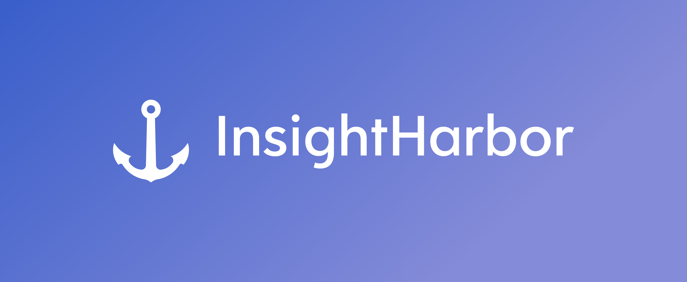

# InsightHarbor



** Decode pictures, echo prompts; your gateway to visual understanding. **
InsightHarbor leverages image processing ML model provided by AWS Rekognition to analyze pictures and prompt a comprehensive description.

InsightHarbor is containerized and ready to be deployed on any environment. 

To build and run the image locally:
```
docker -version # verify docker package exists
docker build -t insightharbor . # in work dir
docker run -p 8000:8000 insightharbor # access the application locally on port 8000 
```

>System architecture 
